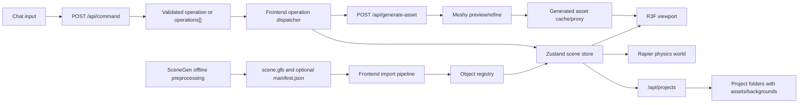

# Architecture

Updated: 2026-05-31

## System Overview

```text
Frontend
  React/Vite JavaScript app
  R3F/Three viewport
  Rapier physics runtime
  Zustand scene/project store
  Object inspector
  Import, save/open, export controls
  Chat panel with visible thoughts and ordered tool calls
  Meshy/background/generated-task UI

Backend
  Fastify/TypeScript API
  Zod request/response/model validation
  /api/command
  /api/background-image
  /api/estimate-object
  /api/generate-asset
  /api/generated-assets/:id/status
  /api/generated-assets/:id/model and model.glb
  /api/projects routes
  /assets/fallback/:file

External
  SceneGen preprocessing, manual/offline
  Meshy preview/refine text-to-3D
  Gemini chat/object/background providers
  Optional OpenAI object estimator fallback
```

## Data Flow



## State Ownership

The frontend scene store owns editor state:

- Imported scene metadata and optional manifest metadata.
- Object registry entries and stable object IDs.
- Object transforms, material appearance, and physics profiles.
- Selection, outliner, viewport mode, overlays, gravity, collisions, and floor state.
- Generated task state, scene background, background gallery, and chat messages.
- Saved project metadata and export-ready scene metadata.

The backend owns external side effects:

- Gemini/local chat command parsing into validated operations.
- VLM metadata estimation through Gemini or local/OpenAI fallback providers.
- Gemini background image generation.
- Meshy preview/refine task creation, status polling, GLB retrieval, and cache/proxy serving.
- Local fallback asset resolution.
- Project folder persistence for saved project JSON, bundled GLBs, and generated backgrounds.

## AI Safety Boundary

AI providers return structured JSON only. The backend validates model output with Zod, then the frontend applies accepted operations through the operation dispatcher.

```text
AI output
-> Zod schema validation
-> normalized SceneOperation or operations[]
-> frontend dispatcher
-> Zustand state update
-> R3F/Rapier reaction
```

No AI response should directly mutate Three.js objects, Rapier bodies, local files, or exported scene data.

## Generated Asset Runtime

1. Chat command parser returns `add_generated_object` or `generate_environment_scene`.
2. Frontend calls `/api/generate-asset`.
3. Backend creates a Meshy preview task with GLB output requested.
4. When preview succeeds, backend starts a Meshy refine task with PBR/HD texture settings.
5. Frontend shows placeholder/status while polling `/api/generated-assets/:id/status`.
6. Backend downloads and caches the refined GLB, then serves a backend URL.
7. Frontend imports the GLB, registers editable objects, estimates/defaults metadata, selects/highlights the inserted object, and removes placeholder state.

## Placement Rules

```ts
type AssetPlacement =
  | { mode: "on_floor" }
  | { mode: "on_object"; target: string }
  | { mode: "at_position"; position: [number, number, number] };
```

Placement is deterministic:

- `on_floor`: place at floor height with a slight vertical offset.
- `on_object`: compute target bounds and place above target center.
- `at_position`: use the exact provided position.

## Physics And Export

Generated and imported objects use simplified colliders based on metadata, prompt, labels, and bounds. Editor transforms are authoritative; when gravity is enabled, dynamic objects fall from their edited positions.

Export produces:

- `scene.glb`: visual scene with current transforms and generated/imported assets.
- `scene.physics.json`: object IDs, labels, transforms, bounds, physics profiles, appearance metadata, and source metadata.
