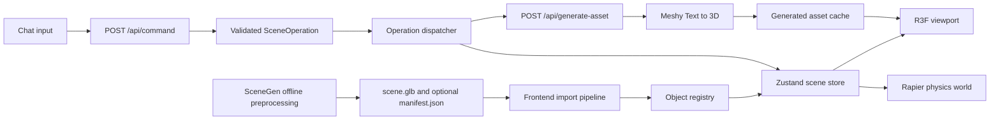

# Architecture

Updated: 2026-05-30

## System Overview

```text
Frontend
  React/Vite app
  R3F/Three viewport
  Rapier physics runtime
  Zustand scene store
  Object inspector
  Chat panel
  Meshy generation status UI
  Import/export controls

Backend
  /api/command
  /api/estimate-object
  /api/generate-asset
  /api/generated-assets/:id/status
  /api/generated-assets/:id/model

External
  SceneGen preprocessing, manual/offline
  Meshy live asset generation
  OpenAI/Gemini VLM for semantic metadata
```

## Data Flow



## State Ownership

The frontend scene store owns application state:

- Imported scene metadata.
- Object registry entries.
- Object transforms.
- Physics profiles.
- Selection state.
- Generated asset task state.
- Export-ready scene metadata.

The backend owns external side effects:

- Chat command parsing.
- VLM metadata estimation.
- Meshy task creation and polling.
- Generated asset download/cache.
- Local fallback asset resolution.

## AI Safety Boundary

AI providers return structured JSON only. The app validates model output with Zod before applying it.

```text
AI output
-> Zod schema validation
-> normalized SceneOperation
-> operation dispatcher
-> Zustand state update
-> R3F/Rapier reaction
```

No AI response should directly mutate Three.js objects, Rapier bodies, local files, or exported scene data.

## Generated Asset Runtime

1. Chat command parser returns `add_generated_object`.
2. Frontend calls `/api/generate-asset`.
3. Backend creates a Meshy text-to-3D preview task with GLB output requested.
4. Frontend inserts a transparent placeholder at the deterministic placement target.
5. Frontend polls `/api/generated-assets/:id/status`.
6. Backend downloads or proxies the returned GLB when generation succeeds.
7. Frontend imports the GLB and registers it as an editable object.
8. Physics defaults are assigned from the prompt, object bounds, and optional metadata estimation.
9. Placeholder is removed and the generated object is selected.

## Placement Rules

```ts
type AssetPlacement =
  | { mode: "on_floor" }
  | { mode: "on_object"; target: string }
  | { mode: "at_position"; position: [number, number, number] };
```

Placement must be deterministic:

- `on_floor`: place at floor height with a slight vertical offset.
- `on_object`: compute target bounds, place above target bounds center, and offset Y by generated asset half-height.
- `at_position`: use the exact provided position.

Do not ask a language model to produce numeric placement unless no scene target exists.

## Physics Rules

Generated Meshy models should not use exact dynamic trimesh colliders. Use simplified colliders based on prompt and bounds:

- ball, sphere, marble: ball collider.
- duck, toy, small object: cuboid or convex hull.
- crate, box: cuboid.
- vase, bottle, cup: cylinder or convex hull.
- furniture: cuboid.
- unknown generated mesh: cuboid.

## Export Contract

Export two artifacts:

- `scene.glb`: visual scene with transforms and generated assets.
- `scene.physics.json`: object IDs, labels, transforms, physics profiles, collider types, and source metadata.
